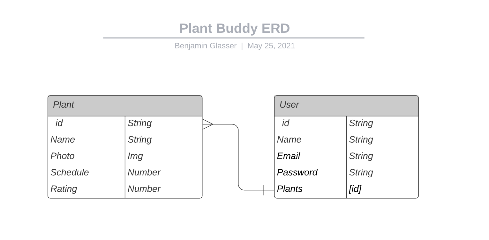
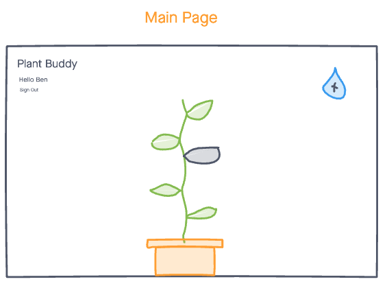
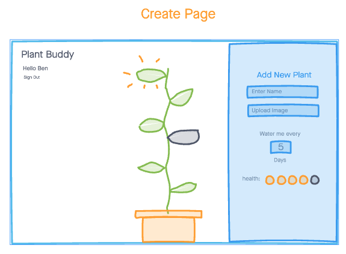
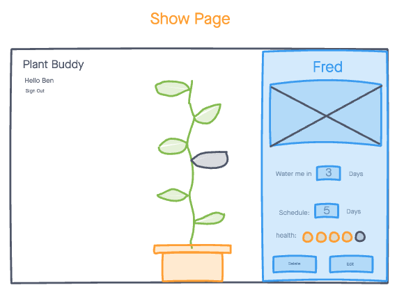
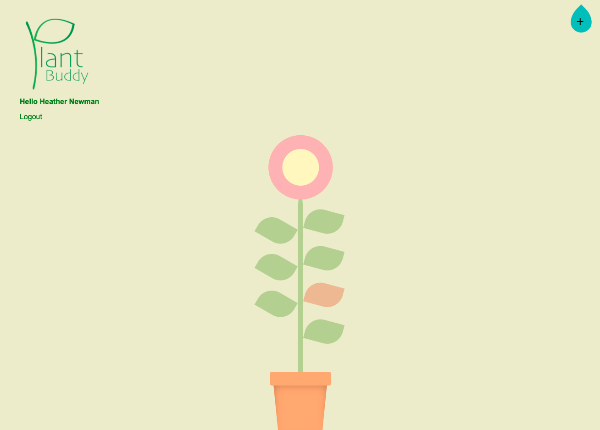
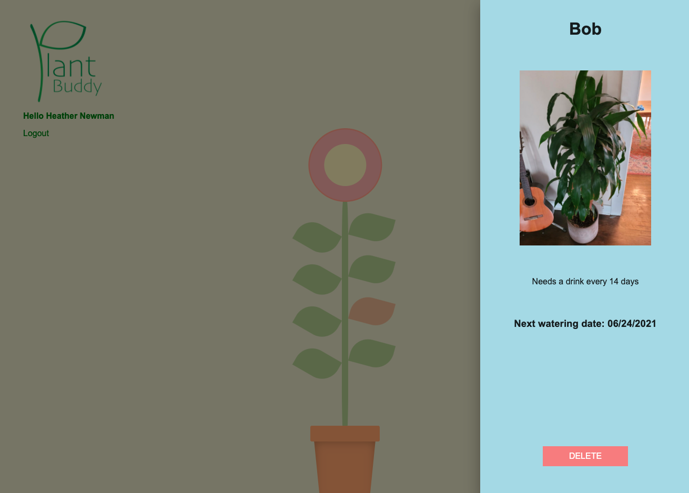

# Plant Buddy

Help keep track of your plants watering schedules with this plant friendly watering reminder app!

## Screenshots

## Technologies

- HTML
- CSS
- JavaScript/jQuery
- Mongoose
- MongoDB
- Express.js
- Node.js
- Google Firebase
- React
- Google Fonts
- Reactstrap
- Moment JS

## Getting Started

[Click here](#) to get started

## Future Enhancements

1. Add relaxing music
2. Add health feature to keep track of plant health
3. Add more extensive edit features
